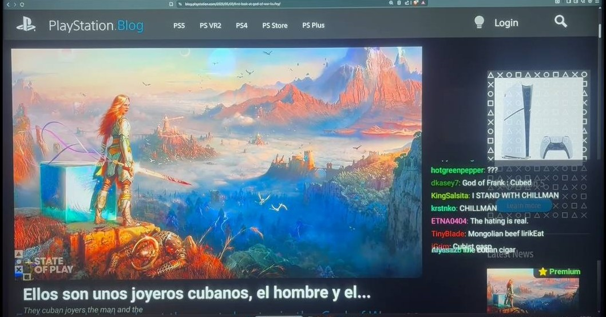
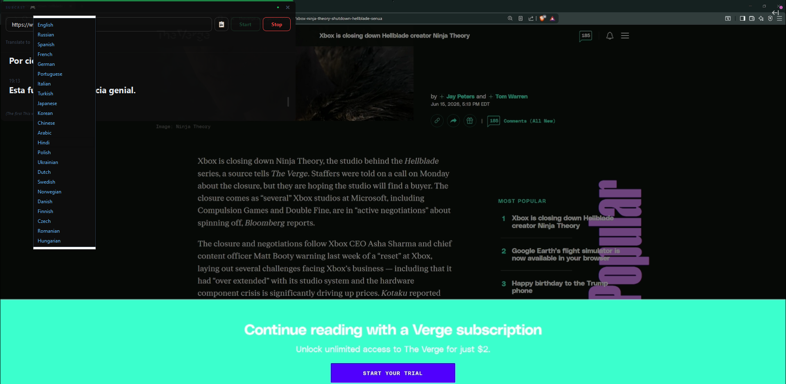
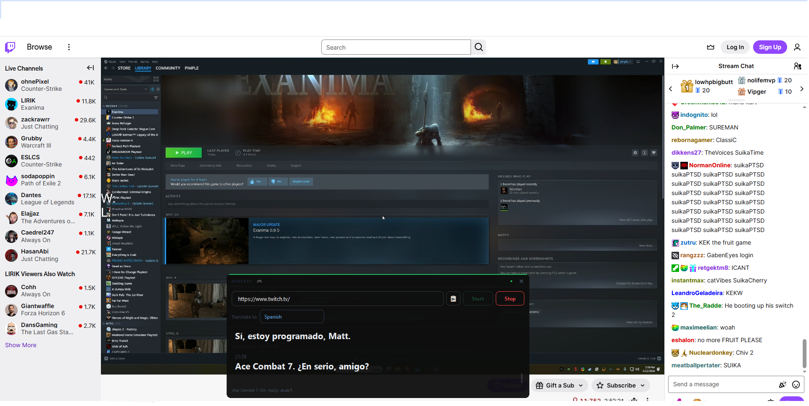

# SubCast 🎙️

**Real-time AI subtitles for live streams — in your language, on your TV.**


SubCast adds live, AI-translated subtitles to Twitch, YouTube Live, and Kick streams — even when you don't speak the streamer's language. Watch a Spanish, Korean, or Japanese streamer with real-time subtitles in your own language, right on your Android TV.

> ⚠️ **Beta software.** SubCast is in early public testing. It works, but expect occasional rough edges. Feedback and bug reports are very welcome — open an [issue](https://github.com/NikoVlasov/SubCast/issues).

---

## 📸 Screenshots

**Live on Android TV** — a Twitch stream with real-time Spanish subtitles and native chat
*(photographed from a TV screen, hence the photo quality)*



**Pick your subtitle language** — 12+ languages, fully remote-navigable



**Desktop overlay** — a floating subtitle window for watching on PC



---

## ✨ What it does

- **Live subtitles** — AI speech recognition + translation with low latency, synced close to real time
- **Automatic language detection** — no need to pick the source language, SubCast figures it out
- **Translate into your language** — choose from 12+ subtitle languages
- **Three platforms** — Twitch, YouTube Live, and Kick
- **Native Twitch chat** — fast, built-in chat (no laggy web view), movable to any corner
- **Twitch login** — see your followed channels and read chat
- **TV-first design** — full-screen by default, navigate everything with your remote
- **Quality control** — Auto / 480p / 720p / 1080p via the on-screen settings menu
- **PC subtitle overlay** — a floating subtitle window for watching on desktop

---

## 📱 Device support

| Device | Method | Experience |
| --- | --- | --- |
| **Android TV** | Install APK | ⭐ Best — full-screen stream + subtitles + chat |
| Windows PC | `widget.py` overlay | Good — floating subtitle window |

The **server runs on a Windows PC** on your network. The Android TV app connects to it over Wi-Fi.

---

## 🚀 Getting started

### Requirements

- A **Windows PC** to run the translation server (any modern PC works — it offloads heavy work to the cloud)
- An **Android TV** device (the app is built for TV — phones aren't supported yet)
- **Python 3.10+**
- **ffmpeg** installed and on your PATH
- A free **[Groq API key](https://console.groq.com)** — for speech recognition
- An **[OpenAI API key](https://platform.openai.com)** (optional) — for higher-quality translation
- PC and TV on the **same Wi-Fi network** (wired or 5 GHz Wi-Fi recommended for smooth playback)

### Installation

**1. Clone the repository**

```bash
git clone https://github.com/NikoVlasov/SubCast.git
cd SubCast
```

**2. Install dependencies**

```bash
pip install -r requirements.txt
```

**3. Create a `.env` file in the project folder with your API keys**

```
GROQ_API_KEY=your_groq_key_here
OPENAI_API_KEY=your_openai_key_here
```

> Only the Groq key is required. The OpenAI key is optional and enables higher-quality translation.

**4. Start the server**

Double-click `run_server.bat`, or run:

```bash
python app.py
```

The server prints its local IP address (e.g. `192.168.0.100:5000`). You'll need this for the app.

**5. Install the Android TV app**

Download `SubCast.apk` from the [Releases](https://github.com/NikoVlasov/SubCast/releases) page and sideload it onto your Android TV.

**6. Connect the app to your server**

Open SubCast on your TV, enter the server address (e.g. `192.168.0.100:5000`), pick a streamer and your subtitle language, and press **Start**.

---

## 🎮 How to use

1. Launch SubCast on your Android TV.
2. (Optional) **Login with Twitch** to see your followed channels.
3. Type a streamer's username (or pick one from your follows).
4. Choose your **subtitle language**.
5. Press **Start** — the stream loads with live translated subtitles.
6. Press a remote button to bring up the on-screen controls (⚙ settings, quality, chat position). Controls auto-hide after a few seconds.

### Want subtitles on your PC instead?

Run the floating overlay:

```bash
python widget.py
```

Paste a stream link, choose your language, and the subtitle overlay appears on your desktop.

---

## 🌍 Supported languages

English · Russian · Spanish · French · German · Portuguese · Italian · Turkish · Japanese · Korean · Chinese · Arabic

---

## 🏗️ How it works

```
Android TV app (SubCast.apk)
        │  Wi-Fi
        ▼
Flask server (your PC)
        │
        ├─ streamlink / yt-dlp  →  captures live stream audio
        ├─ Groq Whisper         →  speech recognition (auto-detect language)
        └─ GPT-4o-mini          →  natural translation
        │
        ▼
Subtitles appear on your TV in real time
```

The server captures short audio chunks from the live edge of the stream, transcribes them with Groq's Whisper, translates with GPT-4o-mini, and serves the result to the app — all within a few seconds.

---

## 🔄 Translation quality

SubCast has two modes:

- **Premium** ⭐ — Groq Whisper + GPT-4o-mini (natural, context-aware translation)
- **Basic** 🔄 — automatic fallback when API limits are hit (free, lower quality)

---

## ⚠️ Known limitations

This is a beta. Honest expectations:

- The **server runs on a PC** and is started from a terminal / `.bat` file. A one-click `.exe` is planned for a future release.
- You need your **own API keys** (Groq is free; OpenAI is optional and paid per use).
- The free Groq tier has **daily limits** — heavy use may temporarily drop to Basic mode.
- Speech recognition can **occasionally mishear** fast speech, names, or words over loud background noise.
- PC and TV **must be on the same local network**.
- Subtitles run a few seconds behind live — this is normal for real-time transcription.

---

## 🛠️ Tech stack

- **Server:** Python, Flask, streamlink, yt-dlp, ffmpeg
- **AI:** Groq Whisper large-v3, OpenAI GPT-4o-mini
- **Android TV:** Kotlin, ExoPlayer (Media3), native IRC chat over WebSocket
- **PC overlay:** PyQt6

---

## 📄 License

MIT License — free to use, modify, and distribute.

---

## 🙌 Feedback

SubCast is a solo project in active development. If you hit a bug or have an idea, please open an [issue](https://github.com/NikoVlasov/SubCast/issues) — it genuinely helps.

---

*SubCast is not affiliated with Twitch, YouTube, or Kick. All trademarks belong to their respective owners.*